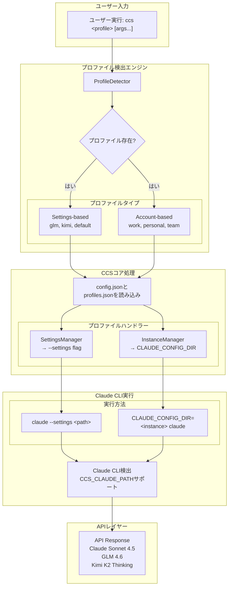

# CCS - Claude Code Switch

<div align="center">


**1コマンド、ダウンタイムなし、複数アカウント**

複数のClaudeアカウント、GLM、Kimiを瞬時に切り替え。<br>
レート制限を回避し、継続的に作業。


[](LICENSE)
[]()
[](https://www.npmjs.com/package/@kaitranntt/ccs)
[](https://claudekit.cc?ref=HMNKXOHN)

**Languages**: [English](README.md) | [Tiếng Việt](README.vi.md) | [日本語](README.ja.md)

</div>

---

## 🚀 クイックスタート

### 🔑 前提条件

**CCSをインストールする前に、サブスクリプションアカウントでClaude CLIにログインしていることを確認してください：**
```bash
claude /login
```

### 主なインストール方法

#### オプション1: npmパッケージ（推奨）

**macOS / Linux / Windows**
```bash
npm install -g @kaitranntt/ccs
```

主要なパッケージマネージャーすべてに対応：

```bash
# yarn
yarn global add @kaitranntt/ccs

# pnpm（ディスク使用量70%削減）
pnpm add -g @kaitranntt/ccs

# bun（30倍高速）
bun add -g @kaitranntt/ccs
```

#### オプション2: 直接インストール（従来型）

**macOS / Linux**
```bash
curl -fsSL ccs.kaitran.ca/install | bash
```

**Windows PowerShell**
```powershell
irm ccs.kaitran.ca/install | iex
```

> **💡 パフォーマンス**: 従来型インストールはNode.jsルーティングをバイパスし起動が高速ですが、デプロイ自動化が容易なためnpm更新を優先します。

### 設定（自動作成）

**CCSはインストール時に自動的に設定を作成します**（npm postinstallスクリプト経由）。

**~/.ccs/config.json**:
```json
{
  "profiles": {
    "glm": "~/.ccs/glm.settings.json",
    "kimi": "~/.ccs/kimi.settings.json",
    "default": "~/.claude/settings.json"
  }
}
```

### カスタムClaude CLIパス

Claude CLIが標準以外の場所（Dドライブ、カスタムディレクトリ）にインストールされている場合は、`CCS_CLAUDE_PATH`を設定してください：

```bash
export CCS_CLAUDE_PATH="/path/to/claude"              # Unix
$env:CCS_CLAUDE_PATH = "D:\Tools\Claude\claude.exe"   # Windows
```

**詳細な設定手順については、[トラブルシューティングガイド](./docs/en/troubleshooting.md#claude-cli-in-non-standard-location)を参照してください。**

---

### 最初の切り替え

> **⚠️ 重要**: GLMまたはKimiプロファイルを使用する前に、対応する設定ファイルでAPIキーを更新する必要があります：
> - **GLM**: `~/.ccs/glm.settings.json`を編集してGLM APIキーを追加
> - **Kimi**: `~/.ccs/kimi.settings.json`を編集してKimi APIキーを追加

```bash
# Claudeサブスクリプションを使用（デフォルト）で高レベルの計画
ccs "マイクロサービスアーキテクチャの実装計画を立てて"

# GLMに切り替えてコスト最適化されたタスクを実行
ccs glm "シンプルなREST APIを作成して"

# Kimiに切り替えて思考能力を活用
ccs kimi "適切なエラーハンドリングで統合テストを書いて"
```

---

## 日常の開発者の課題

開発者は日々多くのサブスクリプションシナリオに直面します：

1. **アカウント分離**: 会社のClaudeアカウントと個人のClaude → 業務と個人のコンテキストを手動で切り替える必要
2. **レート制限**: Claudeがプロジェクト途中で停止 → 手動で`~/.claude/settings.json`を編集
3. **コスト管理**: 2-3つのProサブスクリプション（月$20） vs Claude Maxの5倍コスト（月$100）→ Pro階層が実用的な上限
4. **モデル選択**: タスクごとに異なるモデルの強みを活用 → 手動切り替え

手動コンテキスト切り替えはワークフローを中断します。**CCSがシームレスに管理します**。

## 手動切り替えではなくCCSを使う理由は？

<div align="center">

| 機能 | メリット |
|---------|---------|
| **アカウント分離** | 業務と個人を分離 |
| **コスト最適化** | 2-3つのProアカウント vs Max 5倍コスト |
| **即座の切り替え** | 1コマンド、ファイル編集不要 |
| **ゼロダウンタイム** | ワークフロー中断なし |
| **レート制限管理** | 制限時にアカウント切り替え |
| **クロスプラットフォーム** | macOS、Linux、Windows |

</div>

**ソリューション**:
```bash
ccs work          # 会社のClaudeアカウントを使用
ccs personal      # 個人Claudeアカウントに切り替え
ccs glm           # コスト効率の良いタスク用にGLMに切り替え
ccs kimi          # 代替オプション用にKimiに切り替え
# レート制限に達した？即座に切り替え：
ccs glm           # GLMで作業を続行
# 別の会社アカウントが必要？
ccs work-2        # 2番目の会社アカウントに切り替え
```

---

## 🏗️ アーキテクチャ概要

**v3.0 Login-Per-Profileモデル**: 各プロファイルは独立したClaudeインスタンスで、ユーザーが直接ログインします。資格情報のコピーやvault暗号化は不要です。



---

## ⚡ 機能

- **即座の切り替え** - `ccs glm`でGLMに切り替え、設定編集不要
- **同時セッション** - 複数のプロファイルを異なるターミナルで同時実行
- **独立したインスタンス** - 各プロファイルが独自の設定を保持 (`~/.ccs/instances/<profile>/`)
- **クロスプラットフォーム** - macOS、Linux、Windows - 同一動作
- **ダウンタイムなし** - 即座に切り替え、ワークフロー中断なし


---

## 💻 使用例

```bash
ccs              # Claudeサブスクリプションを使用（デフォルト）
ccs glm          # GLMフォールバックを使用
ccs kimi         # Kimi for Codingを使用
ccs --version    # CCSバージョンとインストール場所を表示
```

### 同時セッション (Multi-Account)
```bash
# 複数のClaudeアカウントを作成
ccs auth create work       # 業務用アカウント
ccs auth create personal   # 個人用アカウント
ccs auth create team       # チーム用アカウント

# ターミナル1 - 業務用アカウント
ccs work "implement feature"

# ターミナル2 - 個人用アカウント（同時実行）
ccs personal "review code"
```

---

### 🗑️ アンインストール

**パッケージマネージャー**
```bash
# npm
npm uninstall -g @kaitranntt/ccs

# yarn
yarn global remove @kaitranntt/ccs

# pnpm
pnpm remove -g @kaitranntt/ccs

# bun
bun remove -g @kaitranntt/ccs
```

**公式アンインストーラー**

**macOS / Linux**
```bash
curl -fsSL ccs.kaitran.ca/uninstall | bash
```

**Windows PowerShell**
```powershell
irm ccs.kaitran.ca/uninstall | iex
```

---

## 🎯 哲学

- **YAGNI**: 「念のため」の機能は追加しない
- **KISS**: シンプルなbash、複雑さなし
- **DRY**: 単一の情報源（設定）

---

## 📖 ドキュメント

**[docs/](./docs/)の完全なドキュメント**:
- [インストールガイド](./docs/en/installation.md)
- [設定](./docs/en/configuration.md)
- [使用例](./docs/en/usage.md)
- [トラブルシューティング](./docs/en/troubleshooting.md)
- [コントリビューション](./CONTRIBUTING.md)

---

## 🤝 コントリビューション

コントリビューションを歓迎します！詳細については[コントリビューションガイド](./CONTRIBUTING.md)をご覧ください。

---

## 📄 ライセンス

CCSは[MITライセンス](LICENSE)の下でライセンスされています。

---

<div align="center">

**レート制限に頻繁に遭遇する開発者のために ❤️ を込めて作成**

[⭐ このリポジトリにスター](https://github.com/kaitranntt/ccs) | [🐛 問題を報告](https://github.com/kaitranntt/ccs/issues) | [📖 ドキュメントを読む](./docs/en/)

</div>
