# CCS - Claude Code Switch

<div align="center">


**One command, zero downtime, multiple accounts**

Switch between multiple Claude accounts, GLM, and Kimi instantly.<br>
Stop hitting rate limits. Keep working continuously.


[](LICENSE)
[]()
[](https://www.npmjs.com/package/@kaitranntt/ccs)
[](https://claudekit.cc?ref=HMNKXOHN)

**Languages**: [English](README.md) | [Tiếng Việt](README.vi.md) | [日本語](README.ja.md)

</div>

---

## 🚀 Quick Start

### 🔑 Prerequisites

**Before installing CCS, make sure you're logged into Claude CLI with your subscription account:**
```bash
claude /login
```

### Primary Installation Methods

#### Option 1: npm Package (Recommended)

**macOS / Linux / Windows**
```bash
npm install -g @kaitranntt/ccs
```

All major package managers are supported:

```bash
# yarn
yarn global add @kaitranntt/ccs

# pnpm (70% less disk space)
pnpm add -g @kaitranntt/ccs

# bun (30x faster)
bun add -g @kaitranntt/ccs
```

#### Option 2: Direct Install (Traditional)

**macOS / Linux**
```bash
curl -fsSL ccs.kaitran.ca/install | bash
```

**Windows PowerShell**
```powershell
irm ccs.kaitran.ca/install | iex
```

> **💡 Performance Tip**: Traditional installs bypass Node.js routing for faster startup, but I prioritize npm updates due to easier deployment automation.

### Configuration (Auto-created)

**CCS automatically creates configuration during installation** (via npm postinstall script).

**~/.ccs/config.json**:
```json
{
  "profiles": {
    "glm": "~/.ccs/glm.settings.json",
    "kimi": "~/.ccs/kimi.settings.json",
    "default": "~/.claude/settings.json"
  }
}
```

### Custom Claude CLI Path

If Claude CLI is installed in a non-standard location (D drive, custom directory), set `CCS_CLAUDE_PATH`:

```bash
export CCS_CLAUDE_PATH="/path/to/claude"              # Unix
$env:CCS_CLAUDE_PATH = "D:\Tools\Claude\claude.exe"   # Windows
```

**See [Troubleshooting Guide](./docs/en/troubleshooting.md#claude-cli-in-non-standard-location) for detailed setup instructions.**

---

### Your First Switch

> **⚠️ Important**: Before using GLM or Kimi profiles, you need to update your API keys in their respective settings files:
> - **GLM**: Edit `~/.ccs/glm.settings.json` and add your GLM API key
> - **Kimi**: Edit `~/.ccs/kimi.settings.json` and add your Kimi API key

```bash
# Use Claude subscription (default) for high-level planning
ccs "Plan the implementation of a microservices architecture"

# Switch to GLM for cost-optimized tasks
ccs glm "Create a simple REST API"

# Switch to Kimi for its thinking capabilities
ccs kimi "Write integration tests with proper error handling"
```

---

## The Daily Developer Pain Point

Developers face multiple subscription scenarios daily:

1. **Account Separation**: Company Claude account vs personal Claude → you must manually switch contexts to keep work and personal separate
2. **Rate Limits Hit**: Claude stops mid-project → you manually edit `~/.claude/settings.json`
3. **Cost Management**: 2-3 Pro subscriptions ($20/month each) vs Claude Max at 5x cost ($100/month) → Pro tier is the practical ceiling for most developers
4. **Model Choice**: Different tasks benefit from different model strengths → manual switching

Manual context switching breaks your workflow. **CCS manages it seamlessly**.

## Why CCS Instead of Manual Switching?

<div align="center">

| Feature | Benefit |
|---------|---------|
| **Account Isolation** | Keep work separate from personal |
| **Cost Optimization** | 2-3 Pro accounts vs Max at 5x cost |
| **Instant Switching** | One command, no file editing |
| **Zero Downtime** | Never interrupt workflow |
| **Rate Limit Management** | Switch accounts when limits hit |
| **Cross-Platform** | macOS, Linux, Windows |

</div>

**The Solution**:
```bash
ccs work          # Use company Claude account
ccs personal      # Switch to personal Claude account
ccs glm           # Switch to GLM for cost-effective tasks
ccs kimi          # Switch to Kimi for alternative option
# Hit rate limit? Switch instantly:
ccs glm           # Continue working with GLM
# Need different company account?
ccs work-2        # Switch to second company account
```

---

## 🏗️ Architecture Overview

**v3.0 Login-Per-Profile Model**: Each profile is an isolated Claude instance where users login directly. No credential copying or vault encryption.

```mermaid
flowchart TD
    subgraph "User Input"
        USER["User runs: ccs &lt;profile&gt; [args...]"]
    end

    subgraph "Profile Detection Engine"
        DETECT[ProfileDetector]
        PROFILE_CHECK{Profile exists?}

        subgraph "Profile Types"
            SETTINGS["Settings-based<br/>glm, kimi, default"]
            ACCOUNT["Account-based<br/>work, personal, team"]
        end
    end

    subgraph "CCS Core Processing"
        CONFIG["Read config.json<br/>and profiles.json"]

        subgraph "Profile Handlers"
            SETTINGS_MGR["SettingsManager<br/>→ --settings flag"]
            INSTANCE_MGR["InstanceManager<br/>→ CLAUDE_CONFIG_DIR"]
        end
    end

    subgraph "Claude CLI Execution"
        CLAUDE_DETECT["Claude CLI Detection<br/>CCS_CLAUDE_PATH support"]

        subgraph "Execution Methods"
            SETTINGS_EXEC["claude --settings &lt;path&gt;"]
            INSTANCE_EXEC["CLAUDE_CONFIG_DIR=&lt;instance&gt; claude"]
        end
    end

    subgraph "API Layer"
        API["API Response<br/>Claude Sonnet 4.5<br/>GLM 4.6<br/>Kimi K2 Thinking"]
    end

    %% Flow connections
    USER --> DETECT
    DETECT --> PROFILE_CHECK
    PROFILE_CHECK -->|Yes| SETTINGS
    PROFILE_CHECK -->|Yes| ACCOUNT

    SETTINGS --> CONFIG
    ACCOUNT --> CONFIG

    CONFIG --> SETTINGS_MGR
    CONFIG --> INSTANCE_MGR

    SETTINGS_MGR --> SETTINGS_EXEC
    INSTANCE_MGR --> INSTANCE_EXEC

    SETTINGS_EXEC --> CLAUDE_DETECT
    INSTANCE_EXEC --> CLAUDE_DETECT

    CLAUDE_DETECT --> API
```



---

## ⚡ Features

- **Instant Switching** - `ccs glm` switches to GLM, no config editing
- **Concurrent Sessions** - Run multiple profiles simultaneously in different terminals
- **Isolated Instances** - Each profile gets own config (`~/.ccs/instances/<profile>/`)
- **Cross-Platform** - macOS, Linux, Windows - identical behavior
- **Zero Downtime** - Switch instantly, no workflow interruption


---

## 💻 Usage Examples

### Basic Profile Switching
```bash
ccs              # Use Claude subscription (default)
ccs glm          # Use GLM fallback
ccs kimi         # Use Kimi for Coding
ccs --version    # Show CCS version and install location
```

### Concurrent Sessions (Multi-Account)
```bash
# Create multiple Claude accounts
ccs auth create work       # Company account
ccs auth create personal   # Personal account
ccs auth create team       # Team account

# Terminal 1 - Work account
ccs work "implement feature"

# Terminal 2 - Personal account (runs concurrently)
ccs personal "review code"
```

---

### 🗑️ Uninstall

**Package Managers**
```bash
# npm
npm uninstall -g @kaitranntt/ccs

# yarn
yarn global remove @kaitranntt/ccs

# pnpm
pnpm remove -g @kaitranntt/ccs

# bun
bun remove -g @kaitranntt/ccs
```

**Official Uninstaller**

**macOS / Linux**
```bash
curl -fsSL ccs.kaitran.ca/uninstall | bash
```

**Windows PowerShell**
```powershell
irm ccs.kaitran.ca/uninstall | iex
```

---

## 🎯 Philosophy

- **YAGNI**: No features "just in case"
- **KISS**: Simple bash, no complexity
- **DRY**: One source of truth (config)

---

## 📖 Documentation

**Complete documentation in [docs/](./docs/)**:
- [Installation Guide](./docs/en/installation.md)
- [Configuration](./docs/en/configuration.md)
- [Usage Examples](./docs/en/usage.md)
- [Troubleshooting](./docs/en/troubleshooting.md)
- [Contributing](./CONTRIBUTING.md)

---

## 🤝 Contributing

We welcome contributions! Please see our [Contributing Guide](./CONTRIBUTING.md) for details.

---

## 📄 License

CCS is licensed under the [MIT License](LICENSE).

---

<div align="center">

**Made with ❤️ for developers who hit rate limits too often**

[⭐ Star this repo](https://github.com/kaitranntt/ccs) | [🐛 Report issues](https://github.com/kaitranntt/ccs/issues) | [📖 Read docs](./docs/en/)

</div>
