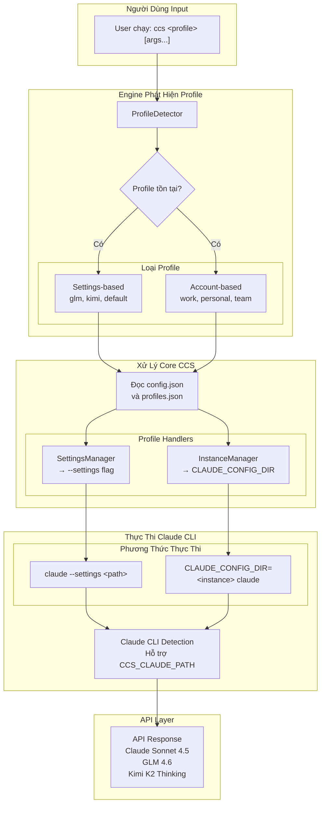

# CCS - Claude Code Switch

<div align="center">


**Một lệnh, không downtime, nhiều tài khoản**

Chuyển đổi giữa nhiều tài khoản Claude, GLM, và Kimi ngay lập tức.<br>
Ngừng hitting rate limits. Làm việc liên tục.


[](LICENSE)
[]()
[](https://claudekit.cc?ref=HMNKXOHN)

**Ngôn ngữ**: [English](README.md) | [Tiếng Việt](README.vi.md) | [日本語](README.ja.md)

</div>

---

## 🚀 Bắt Đầu Nhanh

### 🔑 Điều Kiện Tiên Quyết

**Trước khi cài đặt CCS, hãy đảm bảo bạn đã đăng nhập vào Claude CLI với tài khoản subscription:**
```bash
claude /login
```

### Phương Pháp Cài Đặt Chính

#### Option 1: npm Package (Được khuyến nghị)

**macOS / Linux / Windows**
```bash
npm install -g @kaitranntt/ccs
```

Tất cả các trình quản lý package chính đều được hỗ trợ:

```bash
# yarn
yarn global add @kaitranntt/ccs

# pnpm (ít hơn 70% dung lượng đĩa)
pnpm add -g @kaitranntt/ccs

# bun (nhanh hơn 30x)
bun add -g @kaitranntt/ccs
```

#### Option 2: Cài Đặt Trực Tiếp (Truyền thống)

**macOS / Linux**
```bash
curl -fsSL ccs.kaitran.ca/install | bash
```

**Windows PowerShell**
```powershell
irm ccs.kaitran.ca/install | iex
```

> **💡 Mẹo hiệu năng**: Cài truyền thống bỏ qua Node.js routing để khởi động nhanh hơn, nhưng tôi ưu tiên cập nhật npm do triển khai dễ dàng hơn.

### Cấu Hình (Tự Tạo)

**CCS tự động tạo cấu hình trong quá trình cài đặt** (thông qua script postinstall của npm).

**~/.ccs/config.json**:
```json
{
  "profiles": {
    "glm": "~/.ccs/glm.settings.json",
    "default": "~/.claude/settings.json"
  }
}
```

### Đường Dẫn Claude CLI Tùy Chỉnh

Nếu Claude CLI được cài đặt ở vị trí không chuẩn (ổ D, thư mục tùy chỉnh), đặt `CCS_CLAUDE_PATH`:

```bash
export CCS_CLAUDE_PATH="/path/to/claude"              # Unix
$env:CCS_CLAUDE_PATH = "D:\Tools\Claude\claude.exe"   # Windows
```

**Xem [Hướng dẫn Khắc phục Sự cố](./docs/vi/troubleshooting.vi.md#claude-cli-ở-vị-trí-không-chuẩn) để biết chi tiết cài đặt.**

---

### Lần Chuyển Đổi Đầu Tiên

> **⚠️ Quan trọng**: Trước khi dùng profile GLM hay Kimi, bạn cần cập nhật API key trong file settings tương ứng:
> - **GLM**: Chỉnh sửa `~/.ccs/glm.settings.json` và thêm GLM API key của bạn
> - **Kimi**: Chỉnh sửa `~/.ccs/kimi.settings.json` và thêm Kimi API key của bạn

```bash
# Dùng Claude subscription (mặc định) cho lập trình cấp cao
ccs "Lên kế hoạch triển khai kiến trúc microservices"

# Chuyển sang GLM cho tác vụ tối ưu chi phí
ccs glm "Tạo REST API đơn giản"

# Chuyển sang Kimi để sử dụng khả năng thinking
ccs kimi "Viết integration tests với xử lý lỗi phù hợp"
```

---

## Điểm Đau Hàng Ngày Của Lập Trình Viên

Lập trình viên đối mặt nhiều kịch bản subscription hàng ngày:

1. **Phân Tách Account**: Tài khoản Claude công ty vs Claude cá nhân → bạn phải tự chuyển context để giữ công việc và cá nhân riêng biệt
2. **Hết Rate Limit**: Claude dừng giữa chừng project → bạn phải tự tay sửa `~/.claude/settings.json`
3. **Quản Lý Chi Phí**: 2-3 subscriptions Pro ($20/tháng) vs Claude Max với chi phí 5x ($100/tháng) → Tier Pro là ngưỡng thực tế cho hầu hết lập trình viên
4. **Lựa Chọn Model**: Tác vụ khác nhau hưởng lợi từ thế mạnh model khác nhau → chuyển đổi thủ công

Chuyển đổi context thủ công làm gián đoạn workflow. **CCS quản lý liền mạch**.

## Tại Sao CCS Thay Vì Chuyển Đổi Thủ Công?

<div align="center">

| Tính năng | Lợi ích |
|-----------|---------|
| **Phân Cách Account** | Giữ công việc riêng với cá nhân |
| **Tối Ưu Chi Phí** | 2-3 account Pro vs Max 5x chi phí |
| **Chuyển Đổi Tức Thì** | Một lệnh, không sửa file |
| **Không Downtime** | Không gián đoạn workflow |
| **Quản Lý Rate Limit** | Chuyển account khi hết limit |
| **Đa Nền Tảng** | macOS, Linux, Windows |

</div>

**Giải pháp**:
```bash
ccs cong-ty      # Dùng account Claude công ty
ccs ca-nhan      # Chuyển sang account Claude cá nhân
ccs glm          # Chuyển sang GLM cho tác vụ tối ưu chi phí
ccs kimi         # Chuyển sang Kimi cho lựa chọn thay thế
# Hết rate limit? Chuyển ngay:
ccs glm          # Tiếp tục làm việc với GLM
# Cần account công ty khác?
ccs cong-ty-2    # Chuyển sang account công ty thứ hai
```

---

## 🏗️ Tổng Quan Kiến Trúc

**v3.0 Mô hình Login-Per-Profile**: Mỗi profile là một Claude instance riêng biệt nơi người dùng đăng nhập trực tiếp. Không cần sao chép credentials hay vault encryption.



---

## ⚡ Tính Năng

- **Chuyển Đổi Ngay Lập Tức** - `ccs glm` chuyển sang GLM, không cần sửa config
- **Phiên Đồng Thời** - Chạy nhiều profile cùng lúc ở các terminal khác nhau
- **Instance Riêng Biệt** - Mỗi profile có config riêng (`~/.ccs/instances/<profile>/`)
- **Đa Nền Tảng** - macOS, Linux, Windows - hoạt động giống nhau
- **Không Downtime** - Chuyển đổi ngay lập tức, không gián đoạn workflow


---

## 💻 Ví Dụ Sử Dụng

```bash
ccs              # Dùng Claude subscription (mặc định)
ccs glm          # Dùng GLM fallback
ccs --version    # Hiển thị phiên bản CCS và vị trí cài đặt
```

### Phiên Đồng Thời (Multi-Account)
```bash
# Tạo nhiều tài khoản Claude
ccs auth create cong-ty    # Tài khoản công ty
ccs auth create ca-nhan    # Tài khoản cá nhân
ccs auth create team       # Tài khoản team

# Terminal 1 - Tài khoản công ty
ccs cong-ty "implement feature"

# Terminal 2 - Tài khoản cá nhân (chạy đồng thời)
ccs ca-nhan "review code"
```

---

### 🗑️ Gỡ Cài Đặt

**Package Managers**
```bash
# npm
npm uninstall -g @kaitranntt/ccs

# yarn
yarn global remove @kaitranntt/ccs

# pnpm
pnpm remove -g @kaitranntt/ccs

# bun
bun remove -g @kaitranntt/ccs
```

**Uninstaller Chính Thức**

**macOS / Linux**
```bash
curl -fsSL ccs.kaitran.ca/uninstall | bash
```

**Windows PowerShell**
```powershell
irm ccs.kaitran.ca/uninstall | iex
```

---

## 🎯 Triết Lý

- **YAGNI**: Không có tính năng "phòng hờ"
- **KISS**: Bash đơn giản, không phức tạp
- **DRY**: Một nguồn chân lý duy nhất (config)

---

## 📖 Tài Liệu

**Tài liệu đầy đủ trong [docs/](./docs/)**:
- [Hướng dẫn Cài đặt](./docs/installation.md)
- [Cấu hình](./docs/configuration.md)
- [Ví dụ Sử dụng](./docs/usage.md)
- [Khắc phục Sự cố](./docs/troubleshooting.md)
- [Đóng góp](./CONTRIBUTING.md)

---

## 🤝 Đóng Góp

Chúng tôi chào mừng đóng góp! Vui lòng xem [Hướng dẫn Đóng góp](./CONTRIBUTING.md) để biết chi tiết.

---

## 📄 Giấy Phép

CCS được cấp phép theo [Giấy phép MIT](LICENSE).

---

<div align="center">

**Được tạo với ❤️ cho những lập trình viên hay hết rate limit**

[⭐ Star repo này](https://github.com/kaitranntt/ccs) | [🐛 Báo cáo vấn đề](https://github.com/kaitranntt/ccs/issues) | [📖 Đọc tài liệu](./docs/)

</div>
