# CCS Project Roadmap

## Project Overview

CCS (Claude Code Switch) is a CLI wrapper for instant switching between multiple Claude accounts and alternative models (GLM, GLMT, Kimi). The project enables developers to maintain continuous productivity by running parallel workflows with different AI models, avoiding rate limits and context switching.

### Core Value Proposition
- **Zero Downtime**: Instant profile switching without breaking flow state
- **Cost Optimization**: 81% cost savings through intelligent delegation to GLM/Kimi
- **Parallel Workflows**: Strategic planning with Claude + cost-effective execution with GLM
- **Cross-Platform**: Unified experience on macOS, Linux, and Windows

## Current Status

### Version Information
- **Current Version**: 4.4.0
- **Release Status**: TypeScript conversion complete
- **Build Status**: ✅ Working (npm run build → dist/ccs.js)
- **Test Status**: ✅ All tests passing (39/39 tests)
- **Cross-Platform**: ✅ Windows/macOS/Linux
- **Code Quality**: ✅ ESLint strictness upgrade completed (Phase 01: 39/39 tests pass, 0 violations)

### TypeScript Conversion Summary

**✅ Conversion Completed: 100% (31/31 files)**

The CCS project has been fully converted from JavaScript to TypeScript, delivering enhanced type safety, improved developer experience, and better maintainability.

**Migration Statistics**:
- **Source Files**: 31 TypeScript files converted
- **Lines of Code**: 6,279 lines of TypeScript code
- **Type Coverage**: 100% with zero `any` types
- **Build System**: Full TypeScript compilation pipeline
- **Type Definitions**: Comprehensive type definitions in `src/types/`

**Converted Components**:
- ✅ **Core System** (`src/ccs.ts`) - Main entry point
- ✅ **Authentication** (`src/auth/`) - Profile management and commands
- ✅ **Delegation** (`src/delegation/`) - AI-powered task delegation system
- ✅ **GLMT** (`src/glmt/`) - GLM with Thinking support
- ✅ **Management** (`src/management/`) - System diagnostics and instance management
- ✅ **Utils** (`src/utils/`) - Cross-platform utilities and helpers
- ✅ **Types** (`src/types/`) - Complete type definitions

## Recent Achievements

### TypeScript Conversion Benefits (v4.4.0)

#### Type Safety & Reliability
- **Zero `any` types**: Complete type coverage across the entire codebase
- **Compile-time error detection**: Catches bugs before runtime
- **Interface contracts**: Clear API boundaries and data structures
- **Exhaustive type checking**: Eliminates entire classes of common errors

#### Enhanced Developer Experience
- **IDE support**: Full IntelliSense autocomplete and navigation
- **Refactoring safety**: Type-safe code modifications and renames
- **Self-documenting code**: Type definitions serve as living documentation
- **Better debugging**: Clear type information in debuggers and stack traces

#### Maintainability Improvements
- **Code navigation**: Easy "go to definition" across the entire codebase
- **Impact analysis**: Clear understanding of where types are used
- **API documentation**: Types define precise interfaces for all components
- **Future-proofing**: Easier to add new features without breaking existing code

#### Architecture Enhancements
- **Modular type system**: Comprehensive type definitions in `src/types/`
- **Strict configuration**: TypeScript strict mode enabled for maximum safety
- **Build pipeline**: Automated compilation with source maps and declarations
- **Cross-platform consistency**: Types ensure consistent behavior across platforms

### Phase 01: ESLint Strictness Upgrade Complete ✅

**Completion Date**: 2025-11-27
**Status**: SUCCESS - All quality gates passing

#### Enhanced Code Quality Standards

**ESLint Rules Upgraded** (`eslint.config.mjs`):
- ✅ `@typescript-eslint/no-unused-vars`: `warn` → `error`
- ✅ `@typescript-eslint/no-explicit-any`: `warn` → `error`
- ✅ `@typescript-eslint/no-non-null-assertion`: `warn` → `error`

#### Validation Results
- **TypeScript Compilation**: ✅ Zero type errors
- **ESLint Validation**: ✅ Zero violations (previously 3 warning rules)
- **Test Suite**: ✅ 39/39 tests passing
- **Manual Testing**: ✅ All critical commands working
- **Code Coverage**: ✅ 10,487 lines of TypeScript code analyzed

#### Quality Improvements Achieved
1. **Type Safety Enhancement**: Zero tolerance for unused variables, explicit any types, and non-null assertions
2. **Code Quality Enforcement**: Stricter linting prevents entire categories of potential bugs
3. **Maintainability Boost**: Cleaner, more predictable codebase with enforced standards
4. **Zero Breaking Changes**: All functionality preserved, enhanced reliability only

#### Next Phase Readiness
- **Phase 02 Status**: 🔄 Ready for implementation
- **Focus**: CCS monolithic split (ccs.ts 1071 lines → ~200 lines)
- **Goal**: Modular command handlers for improved maintainability

### Configuration Architecture Improvements
- **Shared Settings**: v4.4 introduces unified `settings.json` sharing across profiles
- **Plugin Support**: Enhanced shared directory structure with plugin support
- **Error Handling**: Improved error management with typed error codes
- **Shell Completion**: PowerShell compatibility improvements

## Current Architecture

### Updated Architecture Diagram

```mermaid
%%{init: {'theme': 'base', 'themeVariables': { 'primaryColor': '#1f2937', 'edgeLabelBackground':'#374151', 'clusterBkg':'#374151'}}}%%
graph TB
    subgraph "TypeScript Source Layer"
        MAIN[src/ccs.ts - Main Entry]
        AUTH[src/auth/ - Authentication]
        DELEGATE[src/delegation/ - AI Delegation]
        GLMT[src/glmt/ - GLM Thinking]
        MGMT[src/management/ - System Mgmt]
        UTILS[src/utils/ - Cross-Platform Utils]
        TYPES[src/types/ - Type Definitions]
    end

    subgraph "Build Output Layer"
        DIST[dist/ccs.js - Compiled Output]
        DECL[dist/ccs.d.ts - Type Declarations]
        MAP[dist/ccs.js.map - Source Maps]
    end

    subgraph "Native Integration Layer"
        BASH[lib/ccs - Bash Implementation]
        PS[lib/ccs.ps1 - PowerShell Implementation]
        SHELLS[Shell Completion Scripts]
    end

    subgraph "Runtime Environment"
        CLAUDE[Claude CLI]
        CONFIG[Configuration Files]
        SHARED[~/.ccs/shared/]
        INSTANCES[Isolated Instances]
    end

    MAIN --> DIST
    AUTH --> DIST
    DELEGATE --> DIST
    GLMT --> DIST
    MGMT --> DIST
    UTILS --> DIST
    TYPES --> DECL

    DIST --> CLAUDE
    BASH --> CLAUDE
    PS --> CLAUDE
    SHELLS --> CLAUDE
    CONFIG --> CLAUDE
    SHARED --> CLAUDE
    INSTANCES --> CLAUDE
```



### TypeScript Architecture Benefits

#### Type System Organization
```
src/types/
├── cli.ts           # CLI interface definitions
├── config.ts        # Configuration type schemas
├── delegation.ts    # Delegation system types
├── glmt.ts         # GLMT-specific types
├── utils.ts        # Utility function types
└── index.ts        # Central type exports
```

#### Component Type Safety
- **Authentication**: Type-safe profile management and command execution
- **Delegation**: Structured delegation workflows with typed result handling
- **GLMT**: Type-safe transformation pipelines and proxy management
- **Management**: Typed diagnostics and instance management
- **Utils**: Cross-platform utilities with consistent interfaces

#### Build Pipeline
- **TypeScript Compiler**: `tsc` with strict configuration and comprehensive checks
- **Declaration Generation**: Automatic `.d.ts` file generation for API documentation
- **Source Maps**: Debug-friendly mapping back to TypeScript source files
- **Incremental Builds**: Fast rebuilds with TypeScript incremental compilation

## Development Roadmap

### Next Development Phases

#### Phase 1: TypeScript Foundation Stabilization (v4.4.1 - v4.4.5)
**Timeline**: Immediate - 4 weeks

**Priorities**:
1. **Type System Refinement**
   - Migrate remaining `any` types (target: zero any types)
   - Add generic constraints for better type inference
   - Implement branded types for enhanced type safety
   - Create utility types for common patterns

2. **Build System Enhancement**
   - Add TypeScript ESLint with strict rules
   - Implement pre-commit type checking
   - Add automated type coverage reporting
   - Enhance development build performance

3. **Testing Infrastructure**
   - Migrate tests to TypeScript
   - Add type-safe test utilities
   - Implement mock type definitions
   - Create type-safe test data fixtures

#### Phase 2: Advanced Delegation System (v4.5.0)
**Timeline**: 1-2 months

**TypeScript-Driven Features**:
1. **Smart Delegation Routing**
   - Type-based task classification system
   - Intelligent profile selection algorithms
   - Cost estimation with typed calculation models
   - Performance optimization through type-aware caching

2. **Enhanced Session Management**
   - Type-safe session persistence with serialization
   - Advanced session resumption with state restoration
   - Multi-turn conversation context management
   - Session analytics with typed metrics

3. **Plugin System Foundation**
   - Type-safe plugin API definitions
   - Plugin discovery and registration system
   - Sandboxed plugin execution environment
   - Community plugin marketplace infrastructure

#### Phase 3: Enterprise Features (v4.6.0)
**Timeline**: 2-3 months

**Enterprise-Grade TypeScript Features**:
1. **Team Profile Management**
   - Type-safe role-based access control (RBAC)
   - Centralized configuration management
   - Audit logging with typed event structures
   - Compliance reporting with structured data formats

2. **Advanced Analytics Dashboard**
   - Real-time usage metrics with typed data streams
   - Cost tracking and budgeting with financial types
   - Team productivity analytics with KPI types
   - Performance monitoring with alert types

3. **CI/CD Integration**
   - Type-safe GitHub Actions workflows
   - Automated testing with type validation
   - Deployment pipelines with type checks
   - Infrastructure as Code with TypeScript

### Technical Debt Resolution

#### Immediate Priorities (v4.4.1)
1. **GLMT System Refactoring**
   - Transform GLMT proxy with typed request/response handling
   - Implement type-safe SSE parsing with error recovery
   - Add typed transformation pipelines for API compatibility
   - Create comprehensive GLMT test suites with type safety

2. **Error Handling Enhancement**
   - Implement typed error hierarchies with inheritance
   - Create structured error reporting with localization
   - Add automatic error recovery with typed retry logic
   - Develop error analytics with classification systems

3. **Performance Optimization**
   - Profile and optimize hot paths with typed benchmarks
   - Implement memory-efficient data structures with generics
   - Add lazy loading patterns with type-safe initialization
   - Create performance monitoring with typed metrics

#### Medium-term Improvements (v4.5.0)
1. **Cross-Platform Consistency**
   - Unify behavior across platforms with typed abstractions
   - Implement platform-specific optimizations with type guards
   - Create comprehensive cross-platform test suites
   - Add platform-specific feature detection

2. **API Evolution**
   - Design backward-compatible API evolution strategies
   - Implement API versioning with type migration paths
   - Create deprecation warnings with upgrade guidance
   - Add automated API compatibility testing

## Future Vision (v5.0+)

### Next-Generation Architecture

#### AI-Powered TypeScript Development
1. **Intelligent Code Generation**
   - TypeScript-aware AI code completion
   - Automatic type inference from usage patterns
   - Smart refactoring suggestions with type analysis
   - Code quality recommendations based on type metrics

2. **Adaptive Type System**
   - Dynamic type generation based on runtime behavior
   - Machine learning-assisted type predictions
   - Automatic interface extraction from APIs
   - Smart type narrowing with statistical analysis

#### Enterprise TypeScript Platform
1. **Advanced Team Collaboration**
   - Real-time collaborative TypeScript editing
   - Shared type libraries across projects
   - Automated type governance policies
   - Team-wide type consistency enforcement

2. **Comprehensive Analytics**
   - Type usage analytics and optimization recommendations
   - Code quality metrics with type safety scores
   - Developer productivity tracking with type metrics
   - Technical debt measurement with type analysis

#### Ecosystem Integration
1. **Package Management**
   - Type-safe dependency management
   - Automated vulnerability scanning with type analysis
   - Smart version resolution with compatibility checking
   - Package quality assessment with type metrics

2. **Tool Integration**
   - TypeScript-native IDE extensions
   - Enhanced debugging with type information
   - Performance profiling with type insights
   - Automated testing with type-driven test generation

## Release Notes

### Version 4.4.0 - TypeScript Conversion Complete
**Release Date**: 2025-11-25

#### Major Features
- ✅ **Complete TypeScript Conversion**: All 31 source files migrated to TypeScript
- ✅ **Zero `any` Types**: 100% type coverage with comprehensive type definitions
- ✅ **Enhanced Build Pipeline**: Automated compilation with source maps and declarations
- ✅ **Shared Settings Architecture**: Unified `settings.json` across all profiles
- ✅ **Plugin Support**: Enhanced shared directory structure
- ✅ **ESLint Strictness Upgrade**: Phase 01 completed (2025-11-27) - 3 rules upgraded to error level, 0 violations found

#### Technical Improvements
- **Type Safety**: Compile-time error detection eliminates entire bug categories
- **Developer Experience**: Full IDE support with IntelliSense and navigation
- **Maintainability**: Self-documenting code with comprehensive type definitions
- **Cross-Platform**: Typed abstractions ensure consistent behavior

#### Breaking Changes
- **None**: Fully backward compatible with existing configurations
- **Migration**: Seamless upgrade path with zero user impact

#### Dependencies
- **TypeScript 5.3**: Updated to latest stable version
- **Enhanced Build Process**: Automated compilation and type checking
- **Development Tools**: Improved development tooling and debugging

### Recent Patch Updates
- **v4.3.10**: Package manager cache clearing during updates
- **v4.3.9**: Fixed missing `commands/ccs.md` symlink in npm install
- **v4.3.8**: Resolved missing `~/.ccs/.claude/` directory creation
- **v4.3.7**: Enhanced directory creation during npm install
- **v4.3.6**: Added plugin support to shared directories
- **v4.4.0**: TypeScript conversion complete, shared settings architecture

## Testing Strategy

### TypeScript Testing Infrastructure
1. **Unit Testing with Type Safety**
   - Mocha tests with TypeScript compilation
   - Type-safe test utilities and fixtures
   - Mock implementations with interface compliance
   - Coverage reporting with type metrics

2. **Integration Testing**
   - Cross-platform compatibility validation
   - End-to-end workflow testing with typed data
   - API contract testing with type validation
   - Performance testing with type-aware profiling

3. **Type-Level Testing**
   - TypeScript compiler error verification
   - Type coverage measurement and reporting
   - API surface validation with type checking
   - Dependency graph analysis with type relationships

## Quality Assurance

### TypeScript Quality Metrics
- **Type Coverage**: 100% (target: maintain zero any types)
- **Compiler Strictness**: Maximum strict mode configuration
- **Interface Compliance**: All exports properly typed
- **Documentation Coverage**: Type definitions serve as documentation

### Code Quality Standards
- **ESLint Integration**: TypeScript-specific linting rules
- **Pre-commit Hooks**: Automated type checking before commits
- **CI/CD Pipeline**: Type validation in continuous integration
- **Code Review**: Type safety as review requirement

## Contributing to Roadmap

### TypeScript Development Guidelines
1. **Type-First Development**: Define types before implementation
2. **Zero Any Policy**: Maintain 100% type coverage
3. **Interface Documentation**: Comprehensive JSDoc with type examples
4. **Backward Compatibility**: Evolve APIs without breaking changes

### Feature Contribution Process
1. **Type Design**: Submit type definitions for review
2. **Implementation**: Type-safe implementation with comprehensive tests
3. **Documentation**: Update type documentation and examples
4. **Review**: Peer review focused on type safety and API design

## Community and Ecosystem

### TypeScript Community Engagement
- **TypeScript Best Practices**: Share learnings with TypeScript community
- **Open Source Contribution**: Contribute to TypeScript tooling ecosystem
- **Knowledge Sharing**: Document TypeScript migration experience
- **Community Support**: Help other projects with TypeScript adoption

---

**Document Status**: Living document, updated with each major release
**Last Updated**: 2025-11-27 (Phase 01 ESLint Strictness Upgrade Complete)
**Next Update**: Phase 02 CCS Split Refactoring
**Maintainer**: CCS Development Team